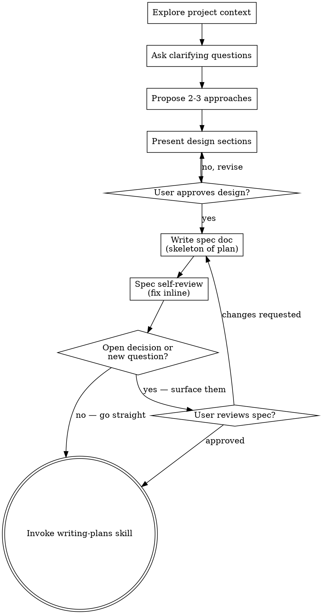

# Brainstorming Ideas Into Designs

Help turn ideas into fully formed designs and specs through natural collaborative dialogue.

Start by understanding the current project context, then ask questions one at a time to refine the idea. Once you understand what you're building, present the design and get user approval.

<HARD-GATE>
Do NOT invoke any implementation skill, write any code, scaffold any project, or take any implementation action until you have presented a design and the user has approved it. This applies to EVERY project regardless of perceived simplicity.
</HARD-GATE>

## WHEN NOT TO THINK: "This Is Too Simple To Need A Design"

Every multi-step refactor, new feature or architecture change goes through this process. "Simple" projects are where unexamined assumptions cause the most wasted work. The design can be short (a few sentences for truly simple projects), but you MUST present it and get approval.

## Checklist

You MUST create a task for each of these items and complete them in order:

1. **Explore project context** — check files, docs, recent commits
2. **Ask clarifying questions** — one at a time, understand purpose/constraints/success criteria
3. **Propose 2-3 approaches** — with trade-offs and your recommendation
4. **Present design** — in sections scaled to their complexity, get user approval after each section
5. **Write spec doc** — the spec is the **skeleton of the implementation plan**: one `.md` file with the section structure the plan will fill in. writing-plans expands this same file in place. Use the cursor plan tool for large projects/refactors.
6. **Spec self-review** — quick inline check for placeholders, contradictions, ambiguity, scope (see below). Fix everything inline. Then flag ONLY the **consequential open decisions** or **genuinely new open questions** that survive — most specs have none (see the bar in Conditional Review Gate). Routine choices don't count; when truly unsure, ask.
7. **Conditional review gate** — proceeding is the default; the spec should be fine and match what was discussed with the user, functionality- and implementation-wise. Stop for user review ONLY if (a) a consequential open decision survived the self-review, or (b) a new, significant open question with more than one viable path forward arose while writing. If you are genuinely unsure whether to stop, ask. Otherwise go straight to step 8. (See Conditional Review Gate.)
8. **Transition to implementation** — invoke writing-plans skill to expand the spec file into the implementation plan

## Process Flow

**The terminal state is invoking writing-plans.** Do NOT invoke frontend-design, mcp-builder, or any other implementation skill. The ONLY skill you invoke after brainstorming is writing-plans.

## The Process

**Understanding the idea:**

- Check out the current project state first (files, docs, recent commits)
- Before asking detailed questions, assess scope: if the request describes multiple independent subsystems (e.g., "build a platform with chat, file storage, billing, and analytics"), flag this immediately. Don't spend questions refining details of a project that needs to be decomposed first.
- If the project is too large for a single spec, help the user decompose into sub-projects: what are the independent pieces, how do they relate, what order should they be built? Then brainstorm the first sub-project through the normal design flow. Each sub-project gets its own spec → plan → implementation cycle.
- For appropriately-scoped projects, ask questions one at a time to refine the idea
- Prefer multiple choice questions when possible, but open-ended is fine too
- Only one question per message - if a topic needs more exploration, break it into multiple questions
- Focus on understanding: purpose, constraints, success criteria

**Exploring approaches:**

- Propose 2-3 different approaches with trade-offs
- Present options conversationally with your recommendation and reasoning
- Lead with your recommended option and explain why

**Presenting the design:**

- Once you believe you understand what you're building, present the design
- Scale each section to its complexity: a few sentences if straightforward, up to 200-300 words if nuanced
- Ask after each section whether it looks right so far
- Cover: architecture, components, data flow, error handling, testing
- Be ready to go back and clarify if something doesn't make sense

**Design for isolation and clarity:**

- Break the system into smaller units that each have one clear purpose, communicate through well-defined interfaces, and can be understood and tested independently
- For each unit, you should be able to answer: what does it do, how do you use it, and what does it depend on?
- Can someone understand what a unit does without reading its internals? Can you change the internals without breaking consumers? If not, the boundaries need work.
- Smaller, well-bounded units are also easier for you to work with - you reason better about code you can hold in context at once, and your edits are more reliable when files are focused. When a file grows large, that's often a signal that it's doing too much.

**Working in existing codebases:**

- Explore the current structure before proposing changes. Follow existing patterns.
- Where existing code has problems that affect the work (e.g., a file that's grown too large, unclear boundaries, tangled responsibilities), include targeted improvements as part of the design - the way a good developer improves code they're working in.
- Don't propose unrelated refactoring. Stay focused on what serves the current goal.

## After the Design

**Documentation:**

- Switch to plan mode and write the validated design (spec) with the planning tool.
- Write the spec as the **skeleton of the implementation plan**: lay out the section/task structure the plan will use, so writing-plans expands this same `.md` file in place rather than starting a new document. Each section holds the design decision now; the plan fills in technical depth later.
- Use elements-of-style:writing-clearly-and-concisely skill if available

**Spec Self-Review:**
After writing the spec document, look at it with fresh eyes:

1. **Placeholder scan:** Any "TBD", "TODO", incomplete sections, or vague requirements? Fix them.
2. **Internal consistency:** Do any sections contradict each other? Does the architecture match the feature descriptions?
3. **Scope check:** Is this focused enough for a single implementation plan, or does it need decomposition?
4. **Ambiguity check:** Could any requirement be interpreted two different ways? If so, pick one and make it explicit.

Fix any issues inline. No need to re-review — just fix and move on.

**Conditional Review Gate:**
The design was already approved section-by-section, so do NOT reflexively stop for another review. Proceeding straight to writing-plans is the default; the spec should be fine and match what was discussed with the user, functionality- and implementation-wise.

Stop for user review in either of these cases:

1. **A consequential open decision survived the self-review** — one that meets ALL THREE tests:
   - **Unconfirmed** — the design discussion genuinely never settled it (not merely "the user didn't say the exact words").
   - **Consequential** — reasonable people could choose differently AND the choice shapes the implementation, so a wrong guess means meaningful rework, not a one-line edit.
   - **Not derivable** — you can't resolve it from the approved design, existing codebase patterns, or an obvious sensible default.

2. **A new, significant open question arose while writing the spec** that has more than one viable path forward — something the design discussion never anticipated. Surface it rather than silently picking a branch.

Routine choices are NOT stop-worthy and do not count as open questions: file/module layout, naming, task ordering, error-message wording, which test to write first, and anything the approved design already implies. Every spec contains dozens of these — pick the sensible option, note it inline, and move on. **But if you are genuinely unsure whether something clears the bar above, ask — don't guess.** Surfacing one real question is far cheaper than building the wrong thing.

- **If you need a ruling:** surface it concisely and get an answer before proceeding. Name the specific decision or question, not a generic "please review":

  > "Writing the spec, I had to decide X (chose A over B), and a new question came up: Y has two viable paths (A or B). These weren't settled earlier — confirm or redirect before I expand into the plan."

  If they request changes, make them and re-run the spec self-review.

- **Otherwise (the common case):** do NOT stop. Proceed straight to writing-plans. The user can still interject; you don't need to solicit it.

**Implementation:**

- Invoke the writing-plans skill to expand the spec file into a detailed implementation plan
- Do NOT invoke any other skill. writing-plans is the next step.

## Key Principles

- **One question at a time** - Don't overwhelm with multiple questions
- **Multiple choice preferred** - Easier to answer than open-ended when possible
- **YAGNI ruthlessly** - Remove unnecessary features from all designs
- **Explore alternatives** - Always propose 2-3 approaches before settling
- **Incremental validation** - Present design, get approval before moving on
- **Be flexible** - Go back and clarify when something doesn't make sense
