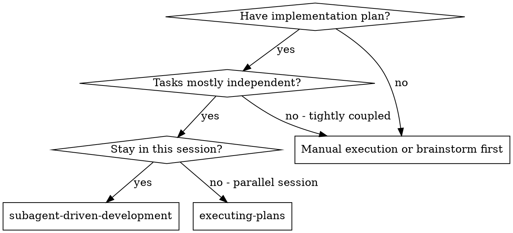
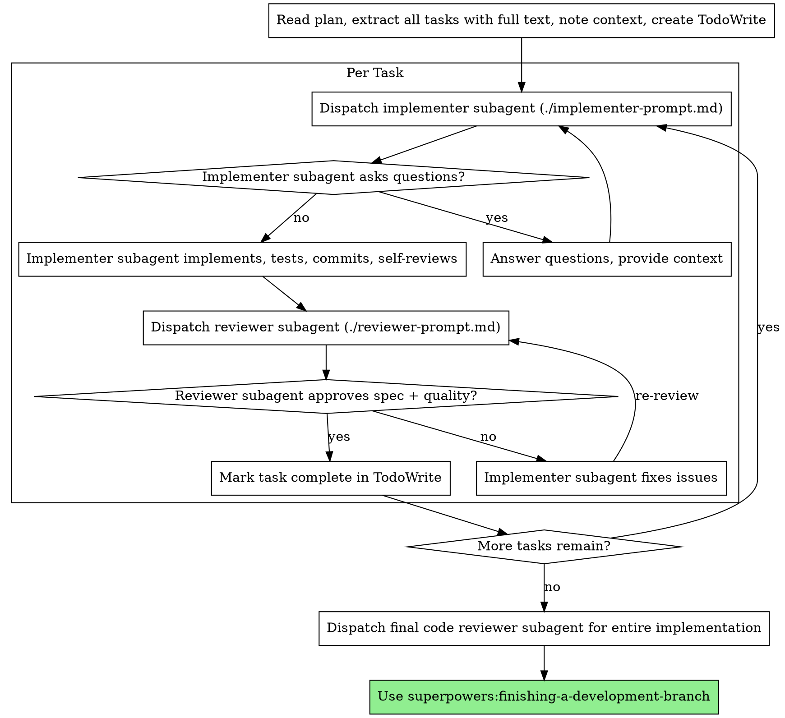

# Subagent-Driven Development

Execute plan by dispatching fresh subagent per task, with a single joint review after each: one reviewer checks spec compliance AND code quality in one pass.

**Why subagents:** You delegate tasks to specialized agents with isolated context. By precisely crafting their instructions and context, you ensure they stay focused and succeed at their task. They should never inherit your session's context or history — you construct exactly what they need. This also preserves your own context for coordination work.

**Core principle:** Fresh subagent per task + single joint review (spec + quality together) = high quality, fast iteration

## Execution Mode: Dynamic Workflow vs Turn-by-Turn

This skill's per-task chain (implement → review → fix loop) is deterministic orchestration. When **dynamic workflows are enabled** ([code.claude.com/docs/en/workflows](https://code.claude.com/docs/en/workflows)) you can encode the whole plan as one `Workflow` script instead of dispatching each subagent turn-by-turn from your own context. The script holds the loop and the intermediate results; your context holds only the final summary.

**Use a Workflow script when ALL hold:**

- Dynamic workflows are enabled AND you have a workflow opt-in — the session is in ultracode mode, the user said `ultracode`/"use a workflow", OR you are executing this skill under that opt-in. Do NOT silently turn a normal execution into a dozens-of-agents workflow run; that scale must be wanted. If unsure, ask once or default to turn-by-turn.
- The plan has enough tasks (~4+) that turn-by-turn coordination would bloat your context.
- Tasks carry complete context (writing-plans produces zero-prior-context tasks), so no clarifying questions are needed mid-run — **a workflow cannot take user input mid-run; only agent permission prompts pause it.**

**Use turn-by-turn dispatch (the rest of this skill) when:**

- Workflows are disabled or not opted into.
- Tasks are few, or you expect to answer implementer questions / resolve blockers interactively.
- The plan is thin enough that a subagent might legitimately need to come back to you.

### Encoding this skill as a Workflow

Map the roles to `agent()` calls and the per-task chain to a `pipeline` stage. Inline the **filled** contents of `./implementer-prompt.md` and `./reviewer-prompt.md` into the agent prompts (agents don't share your session; build exactly what they need). Force structured status/verdict with `schema`.

```javascript
export const meta = {
  name: 'execute-plan',
  description: 'Implement plan task-by-task: implement → review, with fix loop',
  phases: [{ title: 'Implement' }, { title: 'Review' }],
}
// TASKS: full text + context for each task, extracted from the plan by the controller (NOT read by agents).
const STATUS = { type:'object', required:['status','summary'], properties:{
  status:{type:'string', enum:['DONE','DONE_WITH_CONCERNS','NEEDS_CONTEXT','BLOCKED']},
  summary:{type:'string'}, commitSha:{type:'string'}, concerns:{type:'string'} } }
const VERDICT = { type:'object', required:['pass','issues'], properties:{
  pass:{type:'boolean'}, issues:{type:'array', items:{type:'string'}} } }

async function runTask(task, idx) {
  let impl = await agent(implementerPrompt(task), {label:`impl:${task.id}`, phase:'Implement', schema:STATUS})
  if (!impl || impl.status === 'BLOCKED' || impl.status === 'NEEDS_CONTEXT')
    return { task, blocked: true, impl }            // surface to controller; cannot ask user mid-run
  for (let r = 0; r < 3; r++) {                      // bounded review fix loop (spec + quality in one verdict)
    const v = await agent(reviewerPrompt(task), {label:`review:${task.id}`, phase:'Review', schema:VERDICT})
    if (v?.pass) break
    impl = await agent(fixPrompt(task, v.issues), {label:`fix:${task.id}`, phase:'Implement', schema:STATUS})
  }
  return { task, blocked: false, impl }
}

// Sequential by default — preserves commit order and avoids working-tree conflicts:
const results = []
for (let i = 0; i < TASKS.length; i++) { results.push(await runTask(TASKS[i], i)); log(`task ${i+1}/${TASKS.length} done`) }
// If tasks touch DISJOINT files, parallelize with worktree isolation instead (add isolation:'worktree' to impl agents,
// run via parallel(TASKS.map((t,i)=>()=>runTask(t,i))), then merge the worktrees after).
return { results }
```

**Workflow caveats specific to this skill:**

- **No mid-run questions or human escalation.** The implementer-prompt's "ask before starting" step and the `BLOCKED`/`NEEDS_CONTEXT` human-escalation path can't pause for you. The script returns blocked tasks in its result; you read them when the run finishes, resolve them, then resume (cached tasks return instantly) or re-run.
- **Sequential vs parallel.** Plain `for`-await keeps the no-parallel-implementers red flag satisfied on a shared tree. Only go parallel with `isolation:'worktree'` per task, then merge.
- **Fix loops are bounded** (e.g. 3 rounds) — a workflow can't loop forever waiting on you. If a task still fails after the bound, treat it like a blocker and surface it.
- After the run returns, do the final whole-implementation review and `superpowers:finishing-a-development-branch` yourself, in-session.

The Model Selection, Handling Implementer Status, Red Flags, and review semantics below apply to **both** modes — in workflow mode they become the `model:` arg, the status `schema`, and the loop structure rather than turn-by-turn judgment.

## When to Use



**vs. Executing Plans (parallel session):**

- Same session (no context switch)
- Fresh subagent per task (no context pollution)
- Single joint review after each task: spec compliance + code quality in one pass
- Faster iteration (no human-in-loop between tasks)

## The Process



## Model Selection

Use the least powerful model that can handle each role to conserve cost and increase speed.

**Mechanical implementation tasks** (isolated functions, clear specs, 1-2 files): use a fast, cheap model. Most implementation tasks are mechanical when the plan is well-specified.

**Integration and judgment tasks** (multi-file coordination, pattern matching, debugging): use a standard model.

**Architecture, design, and review tasks**: use the most capable available model.

**Task complexity signals:**

- Touches 1-2 files with a complete spec → cheap model
- Touches multiple files with integration concerns → standard model
- Requires design judgment or broad codebase understanding → most capable model

## Handling Implementer Status

Implementer subagents report one of four statuses. Handle each appropriately:

**DONE:** Proceed to the joint spec + quality review.

**DONE_WITH_CONCERNS:** The implementer completed the work but flagged doubts. Read the concerns before proceeding. If the concerns are about correctness or scope, address them before review. If they're observations (e.g., "this file is getting large"), note them and proceed to review.

**NEEDS_CONTEXT:** The implementer needs information that wasn't provided. Provide the missing context and re-dispatch.

**BLOCKED:** The implementer cannot complete the task. Assess the blocker:

1. If it's a context problem, provide more context and re-dispatch with the same model
2. If the task requires more reasoning, re-dispatch with a more capable model
3. If the task is too large, break it into smaller pieces
4. If the plan itself is wrong, escalate to the human

**Never** ignore an escalation or force the same model to retry without changes. If the implementer said it's stuck, something needs to change.

## Prompt Templates

- `./implementer-prompt.md` - Dispatch implementer subagent
- `./reviewer-prompt.md` - Dispatch the joint reviewer subagent (spec compliance + code quality in one pass)

## Example Workflow

```
You: I'm using Subagent-Driven Development to execute this plan.

[Read plan file once]
[Extract all 5 tasks with full text and context]
[Create TodoWrite with all tasks]

Task 1: Hook installation script

[Get Task 1 text and context (already extracted)]
[Dispatch implementation subagent with full task text + context]

Implementer: "Before I begin - should the hook be installed at user or system level?"

You: "User level (~/.config/superpowers/hooks/)"

Implementer: "Got it. Implementing now..."
[Later] Implementer:
  - Implemented install-hook command
  - Added tests, 5/5 passing
  - Self-review: Found I missed --force flag, added it
  - Committed

[Get git SHAs, dispatch joint reviewer]
Reviewer:
  - Spec compliance: ✅ all requirements met, nothing extra
  - Code quality: Strengths: Good test coverage, clean. Issues: None. Approved.

[Mark Task 1 complete]

Task 2: Recovery modes

[Get Task 2 text and context (already extracted)]
[Dispatch implementation subagent with full task text + context]

Implementer: [No questions, proceeds]
Implementer:
  - Added verify/repair modes
  - 8/8 tests passing
  - Self-review: All good
  - Committed

[Dispatch joint reviewer]
Reviewer:
  - Spec compliance: ❌ Issues:
    - Missing: Progress reporting (spec says "report every 100 items")
    - Extra: Added --json flag (not requested)
  - Code quality: Issues (Important): Magic number (100)

[Implementer fixes issues]
Implementer: Removed --json flag, added progress reporting, extracted PROGRESS_INTERVAL constant

[Reviewer reviews again]
Reviewer: ✅ Spec compliant + quality approved

[Mark Task 2 complete]

...

[After all tasks]
[Dispatch final code-reviewer]
Final reviewer: All requirements met, ready to merge

Done!
```

## Advantages

**vs. Manual execution:**

- Subagents follow TDD naturally
- Fresh context per task (no confusion)
- Parallel-safe (subagents don't interfere)
- Subagent can ask questions (before AND during work)

**vs. Executing Plans:**

- Same session (no handoff)
- Continuous progress (no waiting)
- Review checkpoints automatic

**Efficiency gains:**

- No file reading overhead (controller provides full text)
- Controller curates exactly what context is needed
- Subagent gets complete information upfront
- Questions surfaced before work begins (not after)

**Quality gates:**

- Self-review catches issues before handoff
- Single joint review: spec compliance + code quality in one pass
- Review loop ensures fixes actually work
- Spec compliance prevents over/under-building
- Code quality ensures implementation is well-built

**Cost:**

- More subagent invocations (implementer + 1 reviewer per task)
- Controller does more prep work (extracting all tasks upfront)
- Review loop adds iterations
- But catches issues early (cheaper than debugging later)

## Red Flags

**Never:**

- Start implementation on main/master branch without explicit user consent
- Skip the review (it covers both spec compliance AND code quality)
- Proceed with unfixed issues
- Dispatch multiple implementation subagents in parallel (conflicts)
- Make subagent read plan file (provide full text instead)
- Skip scene-setting context (subagent needs to understand where task fits)
- Ignore subagent questions (answer before letting them proceed)
- Accept "close enough" on spec compliance (reviewer found spec gaps = not done)
- Skip the review loop (reviewer found issues = implementer fixes = review again)
- Let implementer self-review replace actual review (both are needed)
- Move to next task while the review has open spec or quality issues

**If subagent asks questions:**

- Answer clearly and completely
- Provide additional context if needed
- Don't rush them into implementation

**If reviewer finds issues:**

- Implementer (same subagent) fixes them
- Reviewer reviews again
- Repeat until approved
- Don't skip the re-review

**If subagent fails task:**

- Dispatch fix subagent with specific instructions
- Don't try to fix manually (context pollution)

## Integration

**Required workflow skills:**

- **superpowers:using-git-worktrees** - ONLY if the user opted into a worktree at session start; otherwise work in the current checkout. Never auto-create a worktree or stop to ask.
- **superpowers:writing-plans** - Creates the plan this skill executes
- **superpowers:requesting-code-review** - Code review template for reviewer subagents
- **superpowers:finishing-a-development-branch** - Complete development after all tasks

**Subagents should use:**

- **superpowers:test-driven-development** - Subagents follow TDD for each task

**Alternative workflow:**

- **superpowers:executing-plans** - Use for parallel session instead of same-session execution
