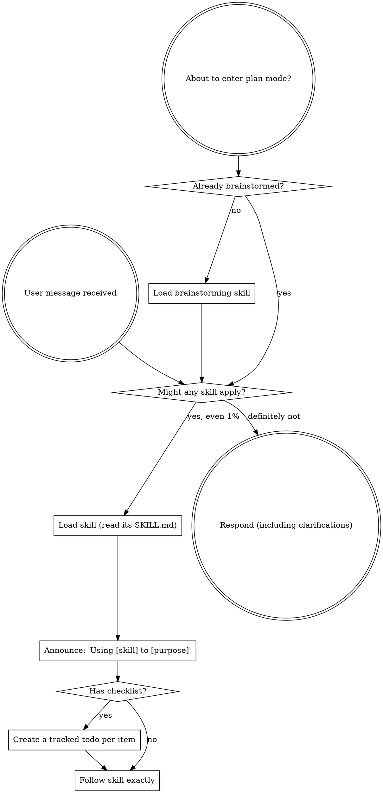

<SUBAGENT-STOP>
If you were dispatched as a subagent to execute a specific task, skip this skill.
</SUBAGENT-STOP>

<EXTREMELY-IMPORTANT>
If you think there is even a 1% chance a skill might apply to what you are doing, you ABSOLUTELY MUST load that skill and follow it.

IF A SKILL APPLIES TO YOUR TASK, YOU DO NOT HAVE A CHOICE. YOU MUST USE IT.

This is not negotiable. This is not optional. You cannot rationalize your way out of this.
</EXTREMELY-IMPORTANT>

## Instruction Priority

Superpowers skills override default system prompt behavior, but **user instructions always take precedence**:

1. **User's explicit instructions** (project instruction files like AGENTS.md/CLAUDE.md, direct requests) — highest priority
2. **Superpowers skills** — override default system behavior where they conflict
3. **Default system prompt** — lowest priority

## How to Access Skills

Skills are listed in the session context with a path to each `SKILL.md`. When a skill might apply, load its full content (read the `SKILL.md` file) and follow it — do not rely on the title alone. Use whatever skill-loading mechanism your environment provides; the rule is the same everywhere: load the full skill content before acting.

# Using Skills

## The Rule

**Load relevant or requested skills BEFORE any response or action.** Even a 1% chance a skill might apply means you should read it and check. If it turns out wrong for the situation, you don’t need to follow it.

## Red Flags

These thoughts mean STOP—you're rationalizing:

| Thought                             | Reality                                                                  |
| ----------------------------------- | ------------------------------------------------------------------------ |
| "This is just a simple question"    | Questions are tasks. Check for skills.                                   |
| "I need more context first"         | Skill check comes BEFORE clarifying questions.                           |
| "Let me explore the codebase first" | Skills tell you HOW to explore. Check first.                             |
| "I can check git/files quickly"     | Files lack conversation context. Check for skills.                       |
| "Let me gather information first"   | Skills tell you HOW to gather information.                               |
| "This doesn't need a formal skill"  | If a skill exists, use it.                                               |
| "I remember this skill"             | Skills evolve. Read the current file.                                    |
| "This doesn't count as a task"      | Action = task. Check for skills.                                         |
| "The skill is overkill"             | Simple things become complex. Use it.                                    |
| "I'll just do this one thing first" | Check BEFORE doing anything.                                             |
| "This feels productive"             | Undisciplined action wastes time. Skills prevent this.                   |
| "I know what that means"            | Knowing the concept ≠ following the skill. Read `SKILL.md` and apply it. |

## Skill Priority

When multiple skills could apply, use this order:

1. **Process skills first** (brainstorming, debugging) - these determine HOW to approach the task
2. **Implementation skills second** (frontend-design, mcp-builder) - these guide execution

"Let's build X" → brainstorming first, then implementation skills.
"Fix this bug" → debugging first, then domain-specific skills.

## Skill Types

**Rigid** (TDD, debugging): Follow exactly. Don't adapt away discipline.

**Flexible** (patterns): Adapt principles to context.

The skill itself tells you which.

## User Instructions

Instructions say WHAT, not HOW. "Add X" or "Fix Y" doesn't mean skip workflows.
